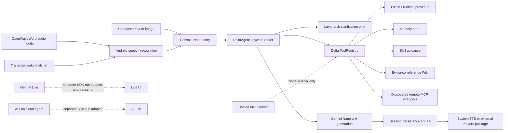

# Delta system integration audit

Status: source audit and implementation checkpoint, 2026-09-27. The current released app increment is Delta Mobile 1.0.83/code139. PixelKit SDK 1.6.56 source now contains explicit per-run capability and trace ownership, but its integrated checks, package publication, Delta migration and unlocked-device evidence are pending. The installed phone remained behind secure keyguard during the latest authorized check, so no new physical hardware, wake, voice, or model behavior is claimed.

## Decision

Delta does not yet have one agent harness. The normal Nano conversation is a deterministic pre-model dispatcher; Gemini Live, the SDK cloud agent, and the ADK diagnostic code are separate execution systems. Skills are guidance, roster entries are prompt contexts, and Wiki pages are cited local notes. None of those labels means a workflow or sub-agent ran.

Keep the current truthful fail-closed surfaces while replacing the split paths with one bounded coordinator. Do not broaden Laya, enable cloud hardware tools, or automate Wiki/Skill writes before that coordinator owns persistence, policy, confirmation, cancellation, tracing, and result evidence.

PixelKit SDK 1.6.56 is the first implemented foundation step. Its former mutable global AI tool registry is replaced by immutable run-owned adapters with strict input/output validation, availability preflight, external effect authorization, deadlines and cancellation. Explicit trace context now crosses cloud, Live, ADK, Nano, recognition and TTS boundaries; bounded local sinks redact sensitive payloads and ignore late callbacks after a scope ends. This does not by itself unify Delta: the app must still build the adapter, own the root context and route every provider through the coordinator.

## Current request and response flow

The solid path is the normal local conversation. Dashed paths bypass parts of it and do not share its confirmation, storage, Skills, Wiki, memory, or traces.

## 1. Harness

### Implemented

- `ConsoleScreen.processPromptWithNano` owns the current Nano submission lock, calls `DeltaAgent.processUserTurn`, persists the user turn, invokes `useGeminiNano.sendMessage`, persists the completed model turn, and optionally calls TTS.
- `DeltaAgent` performs deterministic string/regular-expression routing, executes matched actions sequentially, retrieves at most one semantic memory, prefixes tool results and selected guidance, then asks Nano for text.
- Delta Mobile 1.0.83 routes attached Nano images to real vision/barcode providers, reports Live image turns unavailable, checks direct-response persistence, and removes the unused `deltaNanoAgent` duplicate dispatcher.
- The app fails visibly when the Nano module is absent. The web smoke reached `analyze_image`, displayed a failed tool card, and then displayed `PixelNano module is not in this build`; it did not claim analysis success.

### Boundaries and gaps

- This is not a model/tool/result loop. The model cannot propose a validated follow-up tool call or continue a multi-step procedure.
- Tools execute before the originating user turn is durably recorded. A physical or external effect can therefore succeed even if the later conversation write fails.
- Gemini Live bypasses `DeltaAgent`, Delta's registry, confirmation gate, normal session turns, Skills, Wiki, memory retrieval, and Laya.
- The trace opened in `DeltaAgent` closes before Nano inference, reply persistence, speech, or follow-up listening. Persisted user timing records `modelMs: 0`.
- Custom instructions are applied both as the Nano system instruction and as a quoted user-prompt prefix. There is no canonical context assembly record or prompt-content provenance.
- Delta Mobile 1.0.83 persists `geminiApiKey` in the ordinary JSON settings record, while SDK Live/cloud clients read the native SecureStore owner. SDK 1.6.56 source adds verified migration/save/remove and refuses persistent browser credentials, but the app migration and runtime proof remain pending until Delta consumes that release.
- A card request is attached to the later model turn; model failure can prevent the card from being presented even though the tool request completed.

## 2. Tool loop and policy

### Implemented

- The central Delta registry has 52 built-in definitions plus dynamically discovered MCP wrappers.
- It validates declared required fields, primitive types, integer shape, and enums before execution.
- It applies the confirmation gate, catches executor errors, records duration, logs a trace span, and normalizes nested `error`, `success: false`, or `ok: false` as a failed execution.
- Hardware and storage executors now check real providers and durable results instead of substituting successful defaults. The 1.0.83 battery-gauge route no longer substitutes 85% when no battery level was observed.

### Boundaries and gaps

- Routing is hand-authored keyword matching. Tool registration does not make a tool reachable from natural language.
- No shared run/turn/tool-call identity spans routing, confirmation, execution, model continuation, persistence, and UI projection.
- Validation allows undeclared extra properties and does not implement complete nested JSON Schema constraints.
- Most local tools have no coordinator-enforced timeout, cancellation signal, concurrency contract, idempotency key, retry policy, or output schema.
- Confirmation has two presenter paths. Hard-coded destructive intents return a `gatedAction` and halt the Nano turn; a dynamically gated registry result can coexist with a model response while the global confirmation presenter remains pending. The effect is still gated, but the conversation state is inconsistent.
- Only a single `set_torch` action uses the direct-response shortcut. Other deterministic reads/effects invoke Nano again to restate an already available result.
- Only the first tool execution is stored on the dialogue turn; compound execution details live in transient Delta state/logging rather than the canonical conversation record.

## 3. Skills and Wiki

### Implemented

- Five bundled Skills and authored Skills persist through `SkillStore`. Bundled enable overrides and authored mutations must be durably saved before success is reported.
- `search_skills` exposes enabled metadata. `use_skill` returns `executionMode: "guidance"` and `stepsExecuted: 0`; `DeltaAgent` labels the injected body `GUIDANCE ONLY`.
- Wiki starts empty. A page write requires title, body, evidence kind, and a nonempty reference; revisions and proposal decisions use checked durable persistence with rollback.
- Wiki search/read/write tools are in the central registry and local MCP exports. Writes remain confirmation-gated.

### Boundaries and gaps

- There is no procedure runner. A Skill cannot iterate through its steps, inspect intermediate results, branch, pause for confirmation, or prove completion.
- Skill instructions have no version/digest, trust scope, resource manifest, compatibility probe, or evaluation record. Authored instructions are prompt content and can attempt prompt injection.
- Wiki `evidence.reference` is required but not resolved or verified. A typed string is an attached reference, not proof that the trace, artifact, tool result, observation, or URL exists.
- Wiki search is case-insensitive substring search only. There is no hybrid retrieval, ranking, stale/disputed status, claim model, or citation event in generated answers.
- The Wiki UI displays evidence counts but not evidence kind, reference, excerpt, or capture time.
- `WikiStore.addProposal` has no production caller. Proposal review exists, but no app flow creates proposals.
- Accepting a proposal intentionally records a decision only; it does not author, install, enable, or execute a Skill.

## 4. Memory

### Implemented

- Memory starts empty and persists local facts, optional vectors, categories, pins, and tags to an app-private JSON file.
- Writes, vector updates, deletes, pin toggles, and clear operations update in-memory state only after a durable write succeeds.
- Explicit `recall` uses semantic search when embeddings are available and then a literal substring fallback. Automatic turn context injects the single best semantic result above a 0.62 score.

### Boundaries and gaps

- Automatic retrieval has no lexical fallback when embeddings are unavailable or fail, even though the explicit recall tool does.
- Retrieval returns one memory. Pins, tags, category, recency, multiple supporting facts, and contradiction handling do not affect ranking.
- Stored vectors have no embedding model/version/dimension metadata or re-index migration contract.
- Memory, Wiki, and Skill stores do not serialize concurrent mutations through a per-file queue; overlapping snapshots can lose an update or collide during temporary-file replacement.
- Memory text is inserted into the model prompt without a content-trust boundary. Sensitive memories and derived wake templates are app-private but not encrypted by these stores.
- No retention, export, per-agent scope, or per-conversation privacy policy is enforced by the harness.

## 5. Agents and sub-agents

### Implemented

- The normal roster selects one in-memory specialist prompt modifier. Delta Mobile 1.0.83 labels this as a prompt context, not delegation; tool-scope labels remain informational.
- SDK 1.6.56 source gives `useCloudHardwareAgent`, Live and ADK immutable per-run capability adapters with explicit trace roots, strict contracts and external effect policy. It is not a Delta coordinator or application capability catalog.
- Delta Mobile 1.0.83 does not construct that adapter. AI Lab therefore remains unavailable rather than asking a cloud model to diagnose hardware with an empty or implicit tool inventory.
- Android AppFunctions are a separate system registry and are presented only when the hook reports published functions.

### Boundaries and gaps

- Roster selection does not start a worker, isolate context, enforce a tool allowlist, assign a task, return an artifact, or persist a lifecycle. It resets to the chief context on process restart.
- The active roster entry is a global singleton rather than session-bound state. Session switches do not restore it, `SessionRecord.agentIds` remains disconnected, and persisted `DialogueTurn.agentId` is never populated.
- No normal-chat sub-agent supervisor exists: no parent/child IDs, budgets, depth/concurrency limits, permission inheritance, cancellation propagation, result schema, or terminal-state enforcement.
- The local roster, SDK cloud loop, SDK ADK helpers, Live function calls, and external MCP tools use different registries and policy boundaries.
- The local Agent navigation redesign still contains the phrase `Multi-agent roster & task delegation`; that copy exceeds implemented behavior and remains an owner-controlled uncommitted UI change.

## 6. Laya

### Implemented

- Laya is optional and off by default. An explicit button downloads four revision-pinned files (about 613 decimal MB) from Hugging Face; file sizes are checked before staged files replace the current model.
- Loading is serialized and lazy. `loadMobileFusedAgent` is configured with `executionProvider: "cpu"`.
- Explicit flashlight commands are resolved locally without Laya. Only an ambiguous flashlight phrase can call Laya when the setting is enabled.
- Laya returns an untrusted candidate used to improve a clarification. It never authorizes the torch or executes a registry tool.

### Boundaries and gaps

- Laya is not a general router, planner, MCP selector, argument generator, Skill runner, or sub-agent.
- The 15-second caller deadline does not cancel native model loading or inference already queued behind the serializer.
- Model probability is not measured intent accuracy; there is no calibrated threshold, task corpus, false-action rate, or device latency/power acceptance for routing.
- The current uncommitted Settings redesign says Laya runs on the Tensor G6 TPU, but the service explicitly selects CPU inference. That copy must be corrected without folding unrelated owner changes into an audit commit.
- Downloads are explicit and size-pinned but not hash/signature verified, resumable, metered-network aware, or centrally managed with the wake models.

## 7. OpenWakeWord and transcript wake matching

### Implemented

- `delta-openwakeword` captures 16 kHz mono PCM in Android, runs the openWakeWord mel and embedding ONNX feature models locally, and compares 16×96 embedding windows against a user enrollment.
- Enrollment requires one room sample and three phrase takes. Raw PCM is discarded; derived reference/template vectors, scores, phrase, and timestamp persist locally.
- Monitoring runs only while Delta is visible, foregrounded, in Nano mode, idle, not muted, not speaking, and not already recognizing speech. Native lifecycle callbacks release the microphone on background/destroy.
- On a wake event, Console stops the native monitor before starting Android speech recognition. `WakeWordEngine` is separate text matching over an already-running recognizer and cannot provide idle acoustic wake.

### Boundaries and gaps

- The two feature-model files are neither bundled nor downloaded. They require development-side installation, so release users cannot complete setup through Delta.
- This is template cosine matching, not a trained wake-phrase classifier with broad negative-speech rejection.
- The recorded 1.0.67 device enrollment had background 0.027418, match 0.117039, and threshold 0.090153. Monitoring rearmed and retriggered about ten seconds later; live wake reliability failed acceptance. Those values are evidence, not a basis for inventing an arbitrary threshold floor.
- Correct next work is a representative positive/negative corpus, ROC-based threshold selection, close-phrase negatives, explicit one-shot rearm policy, false accepts/hour, false rejects, handoff success, latency, thermal, and power measurements.
- Enrollment templates have no delete/reset control and are stored as unencrypted voice-derived vectors in app-private JSON.
- Foreground-only wake is intentional. No background microphone service or always-listening claim exists.

## 8. Kokoro and speech output

### Implemented

- Delta does not bundle Kokoro inference. It selects the external Android TTS service `com.k2fsa.sherpa.onnx.tts.engine`; that separate app owns installation and model downloads.
- PixelKit SDK 1.6.57 adds exact explicit-engine preflight and correlated synthesis results. Native code inventories and rechecks the requested package/version, initializes that package, observes the active engine, applies a selected voice/locale, and rejects missing, changed, mismatched or unobservable identity before submitting text.
- `useSpeech.resolveSpeechEngineIdentity()` exposes preflight. `useSpeech.verifySpeechEngine()` resolves identity before speaking a caller-supplied phrase and records utterance-correlated `start`, `done`, `error`, `stop` or `replaced` callbacks under explicit trace/run ownership.
- Platform-default TTS, explicit Android TTS and Gemini Live audio have distinct typed output identities. Phrase content is absent from native status/events and trace metadata.

### Boundaries and gaps

- This is SDK/native source behavior, not current Delta Mobile or phone acceptance. Delta still must consume one persisted engine selection across Console and AI Lab and expose the verification state in its UI.
- Exact package/service identity and callback completion do not prove audible Kokoro voice identity. An unlocked-device run still needs user-confirmed audible evidence or a captured artifact, plus cold/warm timing, stop/replacement, package removal/update, initialization failure and fallback-rejection scenarios.
- The external Sherpa-ONNX app's internal CPU/GPU/NPU execution provider remains unknown unless independently observed. PixelKit reports no inferred provider.
- Delta has no Kokoro installer or bundled model inventory. It must disclose that installation and model downloads belong to the external app and must not claim Tensor execution.

## 9. MCP and external tools

### Implemented

- The local MCP implementation exposes 21 aliases/resources through `PixelHardwareMcpServer`; tool calls delegate to Delta's central registry and preserve its provider errors and confirmation rules.
- `McpHostService` reports running only after a Node HTTP listener binds. React Native reports the listener unavailable rather than pretending a server is hosted.
- The remote client screens endpoint URLs, sends JSON-RPC initialize and tools/list requests, sanitizes discovered metadata, registers namespaced wrappers, times out network calls, and removes wrappers on disable/remove/replacement.

### Boundaries and gaps

- Normal-chat MCP routing uses loose substring matching and passes `{}`. Any discovered tool with required arguments is unusable from chat; ambiguous names can select the wrong wrapper.
- Remote server additions, headers, enabled state, and discovered tools exist in memory only and disappear on restart. The UI says `Save service`, but there is no durable save.
- Two disabled example servers are hard-coded. They are not configured connections, and there is no enable/disable control in the current External Services UI.
- The `sse` transport option is stored but the client still performs the same HTTP POST flow. Command/stdio transports are not implemented.
- The handshake does not carry an MCP session ID, send `notifications/initialized`, paginate tools, or parse an SSE event stream. Compatibility is limited to permissive stateless HTTP servers.
- Remote schemas are reduced to a shallow parameter map; output schemas, annotations, nested constraints, and server provenance are not enforced by the registry.
- Local hosting on the Android app remains unavailable. Binding `0.0.0.0` without authentication would be unsafe if a mobile listener is later added.
- Credentials supplied in headers are process-memory values, not a durable SecureStore-backed credential reference. Persisting raw headers to the JSON store would be the wrong fix.

## How the pieces should work together

One coordinator should own a user turn from accepted input to durable terminal event:

1. Persist the user input and attachment reference.
2. Resolve provider and current capabilities without silent cloud fallback.
3. Retrieve bounded Memory and cited Wiki evidence; activate requested Skill guidance by version/digest.
4. Ask the provider for either final output or one typed action.
5. Resolve one catalog entry across built-in, SDK, and MCP adapters.
6. Strictly validate arguments, capability, permission, policy, connection, and risk.
7. Persist an interruption before confirmation; on resume, revalidate the exact call.
8. Execute with deadline, cancellation, idempotency rules, and observed result verification.
9. Persist the result under one `toolCallId`; continue within a finite step/tool/time budget.
10. Project the same events to chat, cards, traces, TTS, Live, and any worker view.
11. Finish only after the response and terminal run state are durable; then permit follow-up listening.

Laya may rank candidates inside step 4 but never bypass steps 5–8. Skills provide procedure context to step 3 but grant no authority. Wiki supplies cited evidence, not executable instructions. Memory supplies user facts under privacy controls. A sub-agent is a bounded child run of this coordinator. MCP is a capability adapter, not a second policy system. OpenWakeWord/STT and Kokoro are input/output adapters around the same run.

## Prioritized gap list

### P0 — correctness and safety

1. Persist the input/event checkpoint before any effect; make restart and confirmation resume idempotent.
2. Replace the split confirmation paths with one serializable interruption contract.
3. Keep cloud/Live hardware execution disabled until their calls enter the same catalog and confirmation policy.
4. Migrate the Gemini API key from JSON settings into the SDK SecureStore key, scrub the legacy field, and make every cloud surface use the same credential owner.
5. Rework and re-verify acoustic wake against negative speech and one-shot rearm acceptance; do not ship the observed retrigger loop.

### P1 — make current capabilities usable

1. Implement the bounded Nano model/tool/result coordinator and carry trace IDs through model, persistence, TTS, and UI.
2. Replace MCP substring/empty-argument routing; persist non-secret config, keep secrets in SecureStore, and implement the advertised transport/session protocol.
3. Add store-level mutation queues for Memory, Wiki, and Skills.
4. Add hybrid Memory/Wiki retrieval with visible evidence references and lexical fallback when embeddings fail.
5. Add wake-enrollment deletion and protected storage for voice-derived templates.

### P2 — orchestration after the single loop is reliable

1. Add versioned Skill activation and evaluated multi-step procedure execution.
2. Add scoped sub-agents with parentage, inherited policy, finite budgets, cancellation, and structured results.
3. Expand Laya beyond torch clarification only after candidate-routing evaluation demonstrates value.
4. Add user-verifiable Kokoro identity/voice selection and consistent engine use across Console and AI Lab.
5. Add complete output schemas, cancellation, deadlines, and idempotency metadata to every capability adapter.

## Evidence and verification

Source references: Delta Mobile `src/screens/ConsoleScreen.tsx`, `src/core/deltaAgent.ts`, `src/core/tools/`, `src/core/{memoryStore,rosterStore,layaService,wakeWordEngine,wikiStore}.ts`, `src/core/skills/skillStore.ts`, `src/core/mcp/`, `src/features/wake/`, `modules/delta-openwakeword/`, `src/screens/ailab/AgentsSection.tsx`, and settings voice/model sections; PixelKit SDK `packages/sdk/src/ai/` and `packages/native/android/src/main/java/expo/modules/pixelnative/ExplicitSpeechEngine.kt`.

Observed checks for the 1.0.83 increment: TypeScript passed and the final full suite passed 181/181 after the cloud-surface simplification. Focused tool/vision tests passed 34/34. Web smoke at 430×932 attached a real image file, traversed `analyze_image`, displayed the failed tool result, and explicitly reported the absent web Nano module. A prior blob preview failure exposed the need to preserve the captured base64 payload into the persisted image turn; the final rerun had no browser or failed-request errors.

Device boundary: the 651,687,677-byte 1.0.83/code139 debug APK (`SHA-256 C2B0910C64E4CEE79988A4ABC7600AE0A5B9243732B896C05886823F0467AFB5`) built and installed on wireless Pixel `10.0.0.25:37197`; package manager confirmed the identity. ARTEMIS observed secure keyguard, so physical image providers, hardware tools, Laya, wake, STT handoff, Kokoro, and app UI remain unverified until the phone is unlocked and an automation run records scenario, repeats, timing, outcomes, and traces.

## Open questions for user review

- Which three user jobs should define acceptance for the first bounded coordinator?
- Should cloud escalation always ask, be disabled, or allow a separately configured per-task policy? No answer is assumed.
- Should specialist workers be hidden task workers, visible room participants, or both? Prompt contexts remain the current behavior until decided.
- Should wake-derived templates be encrypted, user-exportable, or delete-only? The current plaintext app-private file is an implementation fact, not a privacy-policy decision.

## Glossary

- **Harness:** the owner of one request's model, tools, policy, persistence, UI, and cancellation lifecycle.
- **Tool loop:** bounded propose → validate → approve → execute → observe → continue/finish processing.
- **Prompt context:** instructions applied to the same model; not a separate agent.
- **Sub-agent:** a child run with explicit parentage, scope, budget, cancellation, and structured result.
- **Guidance:** procedure text injected into context; no step is implied to have executed.
- **Evidence reference:** an identifier attached to a Wiki observation; it becomes verified evidence only after the target is resolved and validated.
- **Available:** the required provider and current capability exist for this call.
- **Verified effect:** the requested result was observed or explicitly acknowledged by the owning provider.

## Decision log

- 2026-09-27: preserve the one-pass dispatcher as current fact; do not call it a model-driven tool loop.
- 2026-09-27: remove the duplicate inactive Nano dispatcher and the tool-less cloud diagnostic team surface.
- 2026-09-27: keep Skills guidance-only, roster entries as prompt contexts, and Wiki writes evidence-reference gated.
- 2026-09-27: do not choose an arbitrary wake threshold from one failed enrollment; require measured calibration and device acceptance.
- 2026-09-27: keep shared coordinator, cloud policy, specialist execution form, and wake-template privacy policy open pending explicit user feedback.
- 2026-09-27: implement SDK-owned immutable capability adapters, explicit asynchronous trace ownership and verified native credential removal as a source foundation; keep SDK verification/publication, Delta integration and phone evidence open.
